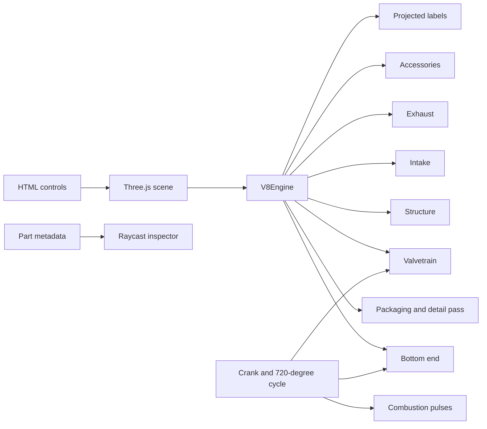

# Procedural V8 Engine

A detailed, fully procedural **90° cross-plane V8 engine** rendered in Three.js. No CAD mesh, STL, glTF model, texture pack, or external geometry asset is used: the complete engine is assembled at runtime from parametric solids, curves, materials, kinematics, and metadata.

> The interactive viewer lives in [`docs/`](docs/) and is intentionally build-free so it can be published directly with GitHub Pages.

## What is modeled

- Deep-skirt V8 block, cylinder banks, liners, decks, main webs, cross-bolted caps, oil pan, timing and bellhousing flanges
- Forged cross-plane crankshaft with main journals, four throws, webs, counterweights, snout and rear flange
- Eight animated pistons with ring packs, skirts and wrist pins
- Eight animated connecting rods solved from slider–crank kinematics every frame
- Two aluminum cylinder heads, two sculpted cam covers and four camshafts
- 32 valves with stems, heads, helical springs, retainers and followers
- Eight sealed coil-on-plug units in molded plug wells
- Central intake plenum, throttle body, eight curved runners, rails and injectors
- Eight individually routed tubular exhaust primaries, paired collectors, clamps and oxygen sensors
- Harmonic damper, water pump, alternator, idlers, tensioner, closed serpentine belt, starter and flywheel
- Service-level detail including gasket seams, fasteners, connectors, wiring clips, sensors, brackets, hose clamps, weld beads, drain hardware and individual starter-ring teeth

## Interaction

The viewer provides:

- True stop at `0 rpm`
- Precision crawl range from `1–20 rpm`
- Nonlinear speed control up to `6,200 rpm`
- Manual `0–720°` four-stroke cycle scrubber
- Deterministic `±1°` and `±10°` crank stepping
- Arrow-key stepping; hold Shift for 10-degree increments
- Four-stroke firing visualization using the order `1-8-4-3-6-5-7-2`
- Cutaway materials to reveal the moving bottom end
- Animated exploded view
- System isolation for block, bottom end, valvetrain, intake, exhaust and accessories
- Click-to-inspect engineering metadata and outline highlighting
- Engineering labels with simple occlusion handling
- Optional wire overlay
- Hero, front, side, top, crankshaft and valvetrain camera presets
- Live FPS, crank angle, active cylinder and triangle telemetry

The default presentation is deliberately slow and clean: 12 rpm, opaque covers and labels hidden. Cutaway and callouts remain available on demand.

## Detail architecture

The base engine remains in [`docs/engine/v8-engine.js`](docs/engine/v8-engine.js). A separate post-construction pass in [`docs/engine/detail-pass.js`](docs/engine/detail-pass.js):

- repackages ignition coils so boots and terminals no longer protrude through the cam covers
- replaces the centerline wiring path with bank-specific clipped looms
- adds cam-cover service interfaces and sealing details
- adds intake instrumentation, injector wiring and rail hardware
- adds header studs, welds and supports
- adds oil-pan, bellhousing and lubrication service hardware
- adds flywheel teeth and crank fasteners
- adds front-drive fasteners, terminals, brackets and coolant connections

Details are attached to the relevant semantic assembly, so they follow exploded-view transforms and remain inspectable through the same metadata system.

## Run locally

The project uses browser-native ES modules. It must be opened through a local web server rather than as a `file://` URL.

```bash
npm run serve
```

Then open `http://localhost:8000`.

No package installation is required. The import map pins Three.js `r184` from jsDelivr.

Syntax-check all JavaScript modules with:

```bash
npm run check
```

## Publish on GitHub Pages

The site is already arranged for branch-based GitHub Pages publication:

1. Open **Settings → Pages**.
2. Choose **Deploy from a branch**.
3. Select branch **main** and folder **/docs**.

The `.nojekyll` file keeps the directory as a plain static ES-module application.

## Design architecture



The engine is deliberately separated into semantic systems. That is useful beyond this demonstration: the same component graph can later become an interchange layer between Monge.jl geometry, Delone.jl meshes, and a browser viewer.

## Geometry and visualization formats

For the eventual Monge.jl → Delone.jl → web workflow, one file should not be forced to serve every purpose:

- **STEP AP242** is the preferred neutral CAD exchange format for exact B-rep solids, assemblies, names, colors, and product structure. Import this into Monge.jl.
- **BREP/XBF** can preserve kernel-native topology more faithfully when both ends use a compatible Open CASCADE representation.
- **Gmsh `.msh` 4.1** or **VTK XML** (`.vtu`, `.vtp`, `.vtm`) should carry finite-element volume/surface meshes and fields from Delone.jl.
- **glTF/GLB** is the preferred compact web delivery format for tessellated geometry, hierarchy, materials and animations.
- **3D Tiles** becomes relevant for city-scale or very large hierarchical scenes with streaming and level of detail.
- **STL** remains useful only as a final triangle soup for printing or a simple GitHub preview; it should not be the master geometry.

See [`docs/format-pipeline.md`](docs/format-pipeline.md) for a concrete proposed architecture.

## Repository layout

```text
.
├── README.md
├── package.json
└── docs
    ├── index.html
    ├── styles.css
    ├── main.js
    ├── format-pipeline.md
    └── engine
        ├── detail-pass.js
        ├── materials.js
        ├── primitives.js
        └── v8-engine.js
```

## License

MIT. Three.js is loaded from its official npm distribution and is separately licensed under MIT.
